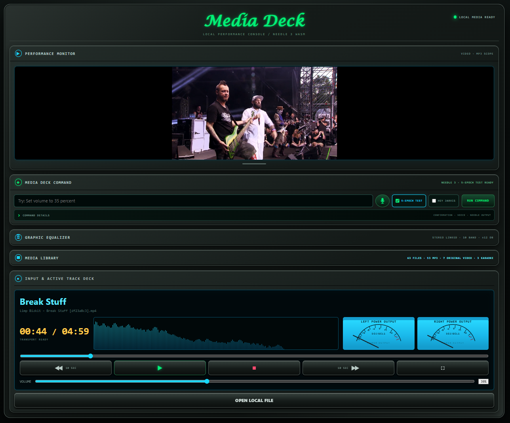

# Needle 3 Media Deck



Needle 3 Media Deck is a local-first, single-page MP3/MP4 player with local
natural-language command routing. The browser UI, media playback, library,
equalizer, manual push-to-talk input, and Needle 3 WASM inference all run on
the local computer.

The application does not require an npm dependency install. Its small Node.js
server serves the SPA, indexes one configured read-only media directory, and
supports byte-range playback. Needle model assets are downloaded separately
from a pinned official release and verified before the server starts.

## Requirements

- Windows 10 or 11
- Node.js 22 or newer
- Current Microsoft Edge or Google Chrome with WebAssembly support
- Internet access once to acquire the pinned Needle 3 assets
- Optional: browser support for on-device speech recognition for manual
  push-to-talk commands
- Optional: Python 3.12 for the local Hey Jarvis wake-word listener

This branch documents and runs the source SPA directly. Packaging is maintained
separately and is not part of this installation path.

## Install and run from source
```powershell
cd C:\Projects
git clone https://github.com/jjmlovesgit/needle3-media-deck.git
cd .\needle3-media-deck\spa
node scripts\acquire-needle.mjs
npm start
```

Open <http://127.0.0.1:8080/>. The acquisition command downloads the pinned,
hash-verified Needle assets once; rerun it only when those assets are absent or
the pinned revision changes.

## Add local media

The default library is the repository's ignored `demo` directory. Create it at
the repository root and place MP3 and MP4 files inside it:

```powershell
New-Item -ItemType Directory -Force ..\demo
Copy-Item 'C:\path\to\media\*.mp3' ..\demo
Copy-Item 'C:\path\to\media\*.mp4' ..\demo
```

Subdirectories are indexed recursively. The server reads media without
renaming, modifying, or exposing source paths. To use another directory, edit
`spa/config/media-sources.json`; relative paths resolve from that config file,
and absolute paths are also accepted.

The **Open Local File** button can play user-selected MP3 and MP4 files without
adding them to the indexed library. Browser security prevents a normal web page
from silently scanning arbitrary folders, so an indexed library requires the
local server and configured directory.

Catalog-backed library rows include **Edit**. The in-app song editor updates
title, artist, album, track, year, aliases, and MP4 classification in
`demo/catalog.json`; it never renames or rewrites the media file. Saved aliases
participate in voice matching and library search. Manually reviewed fields are
protected from later MusicBrainz enrichment.

### Catalog metadata

For each song, the useful catalog fields are:

- **Title:** required.
- **Artist:** strongly recommended.
- **Aliases:** valuable for voice-friendly alternate names.
- **Media type:** MP3, original MP4, or karaoke MP4.
- **Album, track, and year:** optional disambiguation and display fields.

Clear title and artist metadata supports simple, predictable command forms:

```text
Play Artist Title
Play Artist Title MP3
Play Artist Title MP4
```

## Playback and commands

The responsive Performance Monitor uses one persistent media element for both
formats. Video uses `object-fit: contain`, preserving the complete frame.
Controls include play/pause, stop, seeking, ±10 seconds, volume, elapsed time,
duration, equalization, and click-to-toggle playback on active media.

Wait for **NEEDLE 3 · WASM READY**, then type a command and select **Run
Command**. Example patterns use fictional media names:

- `Play Example Track Alpha MP3`
- `Play Example Video Delta MP4`
- `Pause playback`
- `Skip forward 10 seconds`
- `Set volume to 35 percent`
- `Show MP3 files`
- `Show the library`

Needle selects the application tool and the `mp3`, `mp4`, or `any` media type.
Validated calls invoke typed application APIs rather than manipulating the DOM.
The confirmation slider sets the confidence threshold: commands below it wait
for confirmation; a value of 0 executes every call that passes validation.

The command execution boundary is:

```text
Speech or typed command
        ↓
Needle tool proposal
        ↓
Generic grounding and schema validation
        ↓
Deterministic catalog matching
        ↓
Typed Media Deck API
        ↓
Playback or UI action
```

Needle provides the language interpretation. The application provides truth,
safety, identity, and execution.

For manual microphone input, hold the microphone button or **Ctrl+Space**,
speak one command, and release. Availability depends on the browser's on-device
speech recognition and installed language pack.

### Optional Hey Jarvis wake word

The **HEY JARVIS** checkbox enables a local CPU/ONNX listener. While enabled,
it owns the idle microphone; after detection it releases the device for one
Chrome command capture, then resumes. The initial dependency setup is a
one-time network step:

```powershell
cd C:\Projects\needle3-media-deck\spa
npm run setup:wakeword:network
```

After provisioning, the listener and bundled model run locally. For an offline
rebuild, place verified wheels in `spa\wakeword\wheels` and run
`npm run setup:wakeword`.

## Validation

```powershell
cd spa
npm test
npm run test:catalog

cd ..\utilities\media-catalog
npm test
```

`npm test` covers playback state, media classification and matching, library
state, tool validation, source containment, and UI parity. `npm run
test:catalog` requires a populated configured library and an installed Chromium
browser; it dynamically checks every catalog item for its exact typed match and
real playback-clock advancement, then runs live Needle probes for unqualified,
MP3, and generic MP4 requests. Original-video and karaoke remain catalog
classifications, rather than separate voice-routing formats.
The generated report is written to ignored `demo/catalog-regression.json`.

## Optional catalog preparation

`utilities/media-catalog` is a separate command-line utility for scanning a
source library, reviewing proposed metadata queries, optionally enriching
individual songs through MusicBrainz, staging a clean demo library, and editing
song-level catalog metadata in a loopback-only browser UI. Run `npm run edit`
from that directory to edit the default `demo/catalog.json`. It is not imported
by the SPA and never changes the source media files. See
[its README](utilities/media-catalog/README.md).

## Repository layout

- `spa/app` — single-page UI and typed browser application modules
- `spa/scripts` — verified asset acquisition, local server, and regression run
- `spa/schemas` — Needle tool schema
- `spa/tests` — focused unit and browser integration tests
- `spa/docs` — Needle integration and execution boundaries
- `utilities/media-catalog` — optional, separate catalog preparation utility

## Privacy and network behavior

Media playback and Needle routing stay local. The running SPA uses loopback
requests only. Raw microphone audio and transcripts are not persisted. Network
access is used by the explicit Needle asset acquisition command and, when the
user opts in, by the separate MusicBrainz catalog utility.

Needle 3 is provided by
[Cactus Compute](https://github.com/cactus-compute/needle) under Apache-2.0.
The pinned source revision, hashes, adaptation details, and current limitations
are documented in [spa/docs/NEEDLE-INTEGRATION.md](spa/docs/NEEDLE-INTEGRATION.md).
